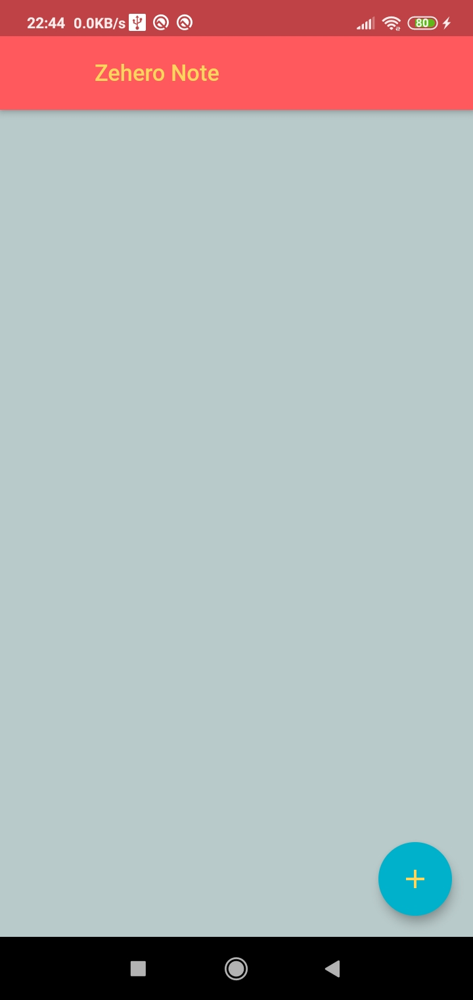
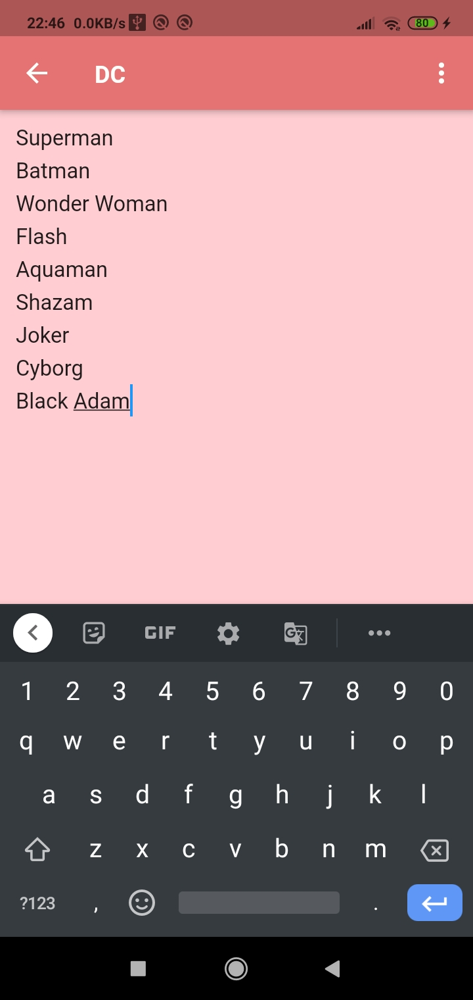
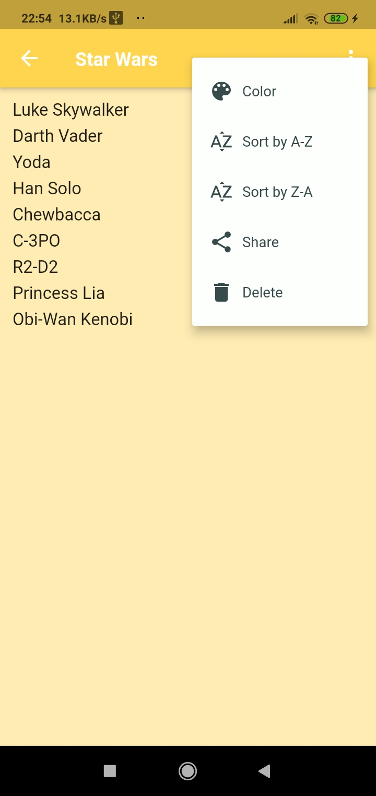
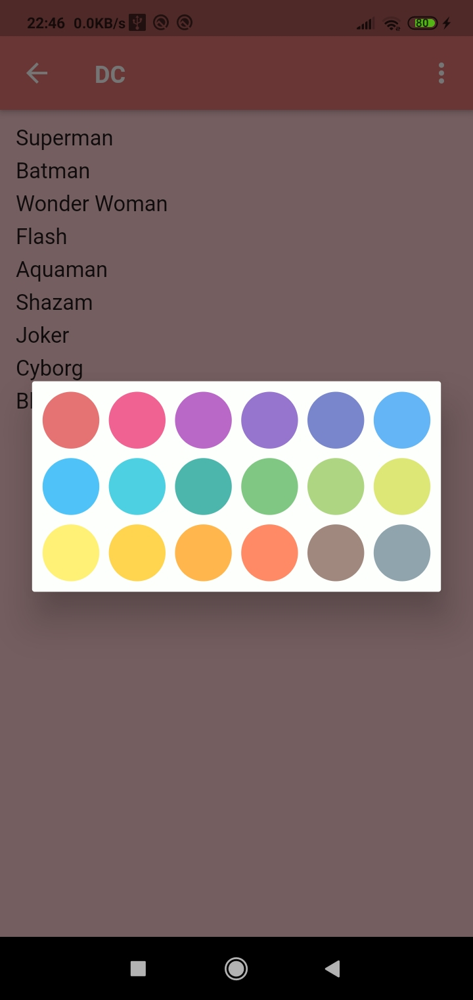
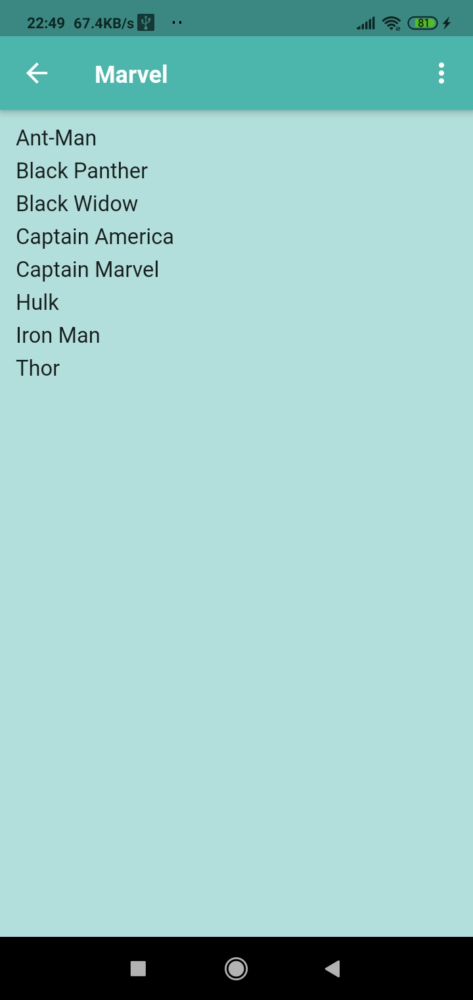
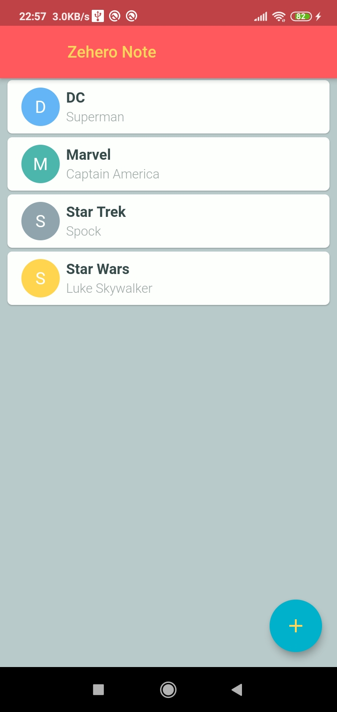
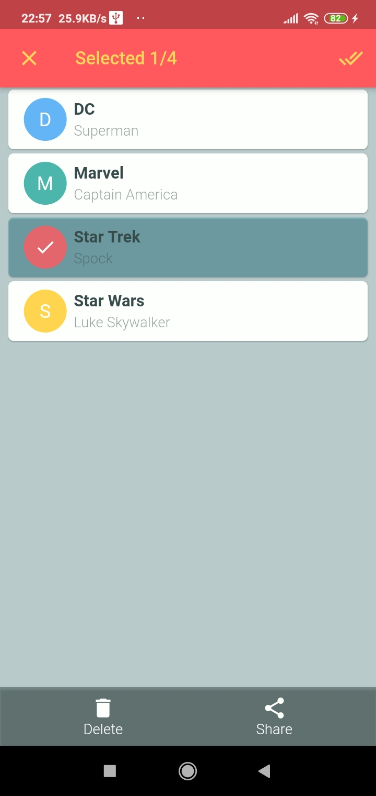

# Zehero Note App

Zehero Note is a simple Note taking mobile app built with Flutter. Zehero Note provides simple UI for saving notes and offers different note colors.
Saved notes can share to other apps simply and easily.

## App Screenshots

  
  
  
  
  
  
  

